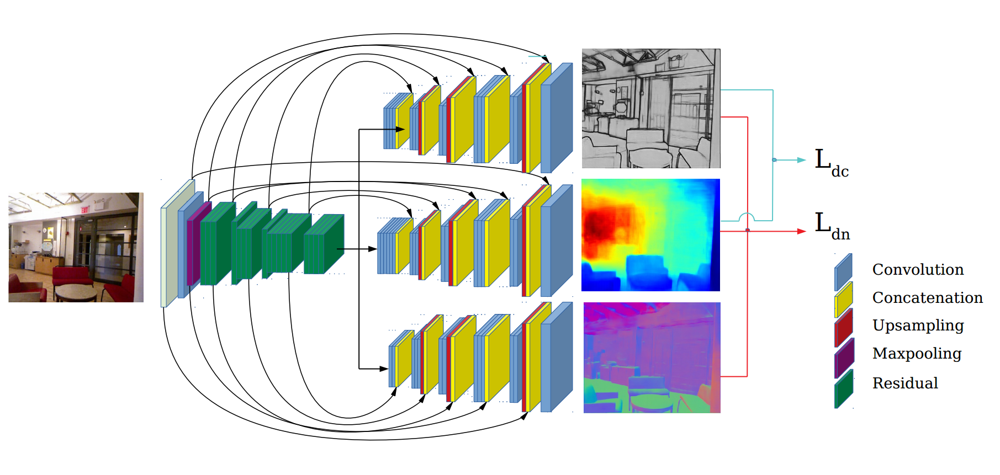

# SharpNet
*Fast and Accurate Recovery of Occluding Contours in Monocular Depth Estimation*, 
by Michaël Ramamonjisoa and Vincent Lepetit.

Link to the paper: [here](http://openaccess.thecvf.com/content_ICCVW_2019/papers/3DRW/Ramamonjisoa_SharpNet_Fast_and_Accurate_Recovery_of_Occluding_Contours_in_Monocular_ICCVW_2019_paper.pdf)

<p align="center">
  
</p>

### Installation

Make sure you have installed the following requirements:

- Python3
- [Pytorch](https://pytorch.org/get-started/locally/)
- OpenCV
- numpy, imageio, Pillow, matplotlib

Optional (for training):
- [TensorboardX](https://github.com/lanpa/tensorboardX)
- skimage

Clone the repository and download the trained weights:
- [on PBRS](https://drive.google.com/open?id=1NahBpG1AXNlWItcb9Uf9VXHmD8iSCntZ)
- [after finetuning on NYUv2](https://drive.google.com/open?id=1UTruzxPxQdoxF44X7D27f8rISFU0bKMK)

Weights trained on NYUv2 should be used for depth estimation, ***however*** weights trained on synthetic data only 
provide sharper normals and contours predictions.

```
git clone https://github.com/MichaelRamamonjisoa/SharpNet.git
cd SharpNet
mkdir models && cd models
```

Put the trained weights in the models/ directory.

## Demo

### On your test image
Try the [demo.py](https://github.com/MichaelRamamonjisoa/SharpNet/blob/master/demo.py) 
script to test our network on your image :

```
python3 demo.py --image $YOURIMAGEPATH \
--cuda CUDA_DEVICE_ID\
--model models/final_checkpoint_NYU.pth \
--normals \
--depth \
--boundary \
--bias \
--scale SCALEFACTOR 
```

The network was trained using 640x480 images, therefore better results might be 
observed after rescaling the image with SCALEFACTOR different than 1. 

Here is what you can get on your test image:


If you want to display the predictions, use the --display flag.

### Live demo
To run the live version of SharpNet, connect a camera and run demo.py with the --live flag.
- Make sure your camera is detected by OpenCV beforehand.
- Press 'R' on your keyboard to switch between normals, depth, contours and RGB
- Press 'T' to save your image and its predictions
- Press 'Q' to terminate the script


## Training
### Pretrained weights
The PBRS dataset is currently offline due to instructions of SUNCG authors (see 
[this](https://github.com/yindaz/pbrs/issues/11) and [this](https://github.com/shurans/SUNCGtoolbox/issues/32)). 
Therefore exact reproduction of our training procedure cannot be done properly. 

### Finetuning 
For finetuning on NYUv2 Depth dataset, you will need the [dataset](https://cs.nyu.edu/~silberman/datasets/nyu_depth_v2) and split:

```
mkdir datasets
wget -O datasets/nyuv2_splits.mat http://horatio.cs.nyu.edu/mit/silberman/indoor_seg_sup/splits.mat
wget -O datasets/nyu_depth_v2_labeled.mat http://horatio.cs.nyu.edu/mit/silberman/nyu_depth_v2/nyu_depth_v2_labeled.mat
```

Use the following command to train the network on NYUv2:

```
python3 train_sharpnet.py --dataset NYU \
--rootdir ../datasets/ \
-b BATCH_SIZE \
--cuda CUDA_DEVICE_ID --cpu NUM_PROCESSES \
--boundary --normals --depth \
--lr 8e-3 --max-epoch 80 \ 
--pretrained-model ../models/final_checkpoint_PBRS.pth \
--bias \
--exp_name CUSTOM_EXPERIMENT_NAME \
--consensus \
--freeze normals,boundary
```

Set **BATCH_SIZE**, **NUM_PROCESSES** based on your GPU and CPU capabilities.
A GPU is required for training (multiple GPU is not supported yet).

*Work in progress: argument parsing with configuration file.* 

Please read the paper for details on parameters we used.

## Evaluation

### NYUv2-OC dataset
You can find our manually annotated dataset used for occluding contour quality evaluation [here](https://drive.google.com/file/d/1HsQTlAPKzQxyLyh-HLUvNF5-igTXOwSd/view?usp=sharing).


### Run the code
Run the evaluation code using:

```
python3 eval.py \
--rootdir DIR_CONTAINING_ALL_PREDICTIONS \
--cuda CUDA_DEVICE_ID \
--pretrained-model ../models/final_checkpoint_PBRS.pth \
--edges --crop \
--savepath PREDICTION_SAVEPATH \
--low LOW_CANNY_THRESHOLD \
--high HIGH_CANNY_THRESHOLD
```

Replace all capital FIELDS with appropriate values.

## Citation

If you find SharpNet useful in your research, please consider citing:
```
@article{ramamonjisoa2019sharpnet,
    Title = {SharpNet: Fast and Accurate Recovery of Occluding Contours in Monocular Depth Estimation},
    Author = {Michael Ramamonjisoa and Vincent Lepetit},
    Journal = {The IEEE International Conference on Computer Vision (ICCV) Workshops},
    Year = {2019}
}
```
